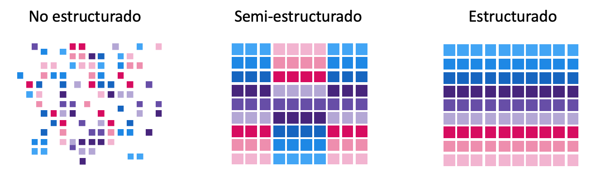
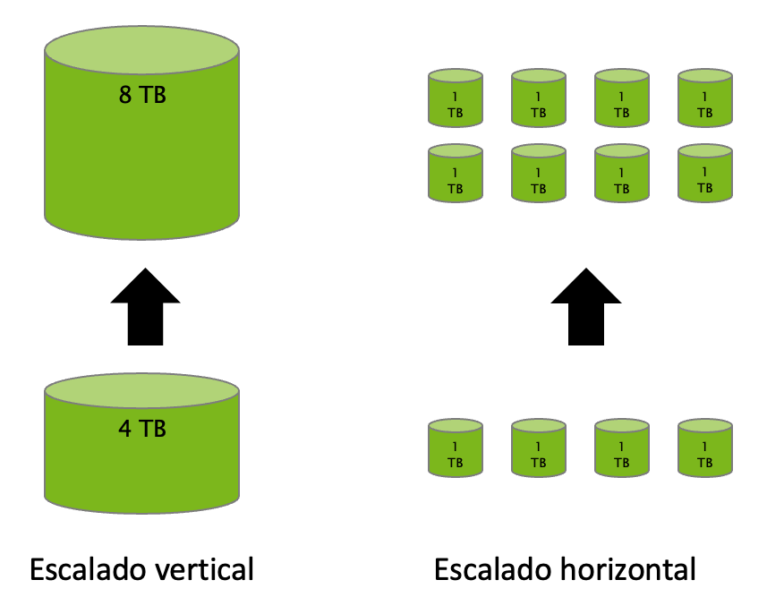
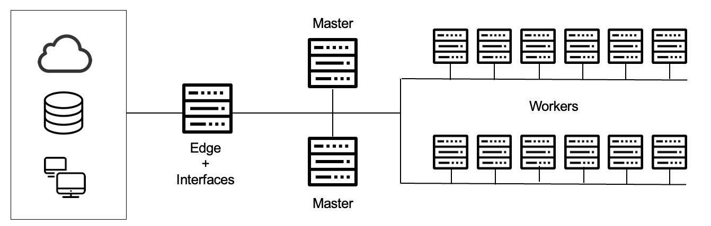

# UD 6 - Apache Hadoop

**Apache Hadoop** es un framework de software que soporta **aplicaciones distribuidas** bajo una licencia libre. Permite a las aplicaciones trabajar con miles de nodos y petabytes de datos.

Fue inicialmente concebido para resolver un problema de escalabilidad en Nutch, un motor de búsqueda Open Source que pretendía indexar mil millones de páginas web.

<figure style="align: center;">
    
    <figcaption>Figura 6.1: Figura6.1_Componentes básicos de Hadoop</figcaption>
</figure>

Al mismo tiempo, Google había publicado los documentos que describían su novedoso sistema de archivos distribuidos, el Google File System GFS), y MapReduce, un framework de computación para procesamiento paralelo. La exitosa implementación de estos conceptos en Nutch resultó en dos proyectos separados, el segundo se convirtió en Hadoop, un proyecto Apache de primera clase. ???
//Introducir Map Reduce o después???

!!! Note "**Hadoop**"

    El nombre de Hadoop no es ningún acrónimo, sino un nombre inventado. Su creador se lo puso por un elefante amarillo de peluche que tenía su hijo. Pensó que un nombre corto, relativamente fácil de deletrear y pronunciar sería adecuado

Si Big Data es la filosofía de trabajo para grandes volúmenes de datos, [Apache Hadoop](http://hadoop.apache.org/) es la tecnología catalizadora. **Hadoop** puede escalar hasta miles de ordenadores creando un clúster con un almacenamiento del orden de petabytes de información.

!!! info "¿Qué es Hadoop?"

    Apache Hadoop es una **plataforma opensource** que ofrece la capacidad de **almacenar y procesar**, a “bajo” **coste**, grandes **volúmenes** de datos, sin importar su **estructura**, en un entorno **distribuido, escalable y tolerante a fallos**, basado en la utilización de hardware commodity y en un paradigma acercamiento del **procesamiento a los datos**. 

Hadoop es una **plataforma**, lo que significa que es la base sobre la que construir aplicaciones. Se podría hacer el símil a que Hadoop es una caja de herramientas que proporciona un conjunto de herramientas con las que construir una gran variedad de aplicaciones que requieran almacenar y procesar grandes volúmenes de datos. La selección de qué herramienta utilizar para cada aplicación la realizaremos en función de las necesidades de cada caso de uso.

Otras soluciones, como MongoDB u otras bases de datos NoSQL no se consideran plataformas, ya que tienen un único propósito y ofrecen un tipo de funcionalidad.

Hadoop aglutina una serie de **herramientas** para el procesamiento distribuido de grandes conjuntos de datos a través de clústers de ordenadores utilizando modelos de programación sencillos.

Sus características son:

- **Confiable**: Crea múltiples copias de los datos de manera automática y, en caso de fallo, vuelve a desplegar la lógica de procesamiento.
- **Tolerante a fallos**: Tras detectar un fallo aplica una recuperación automática. Cuando un componente se recupera, vuelve a formar parte del clúster. En Hadoop los fallos de hardware se tratan como una regla, no como una excepción.
- **Heterogeneo**: Los datos que pueden almacenarse y procesarse en Hadoop pueden tener cualquier tipo: estructurados, semiestructurados o datos no estructurados.

<figure style="align: center;">
    
    <figcaption>Figura6.2_Hadoop: Datos heterogéneos</figcaption>
</figure>

- **Portable**: Se puede instalar en todo tipos de hardware y sistemas operativos.
- **Escalable**: Los datos y su procesamiento se distribuyen sobre un clúster de ordenadores (escalado horizontal), desde un único servidor a miles de máquinas, cada uno ofreciendo computación y almacenamiento local.

<figure style="align: center;">
    
    <figcaption>Figura6.3_Hadoop: Escalable</figcaption>
</figure>

- **Distribuido**: Hadoop se basa en una infraestructura que tiene muchos servidores (también llamados nodos) que trabajan conjuntamente para almacenar o para procesar los datos, a diferencia de los sistemas centralizados, donde todo se realiza en un único servidor.

## 6.1 Componentes y Ecosistema

<figure style="align: center;">
    
    <figcaption>Figura6.4_Ecosistema Hadoop</figcaption>
</figure>

El **núcleo de Hadoop** se compone de:

- un conjunto de utilidades comunes (Hadoop Common)
- **HDFS (Hadoop Distributed File System)**: un sistema de ficheros distribuidos (capa de almacenamiento) que almacena los datos en una estructura basada en espacios de nombres (directorios, subdirectorios, etc)
- **YARN**: un gestor de recursos (capa de procesamiento) para el manejo del clúster y la planificación de procesos, que permite ejecutar aplicaciones sobre los datos almacenados en HDFS
- **MapReduce**: un sistema para procesamiento paralelo de grandes conjuntos de datos, con aplicaciones que lo utilizan de forma transparente.

!!! note 

    Sin embargo, normalmente se identifica el nombre Hadoop con todo el ecosistema de componentes independientes que suelen incluirse para dotar a Hadoop de funcionalidades necesarias en proyectos Big Data empresariales, como puede ser la ingesta de información, el acceso a datos con lenguajes estándar, o las capacidades de administración y monitorización.
    Estos componentes suelen ser proyectos opensource de Apache.. 

Estos elementos permiten trabajar casi de la misma forma que si tuviéramos un sistema de fichero locales en nuestro ordenador personal, pero realmente los datos están repartidos entre miles de servidores.

Las aplicaciones se desarrollan a alto nivel, sin tener constancia de las características de la red. De esta manera, los científicos de datos se centran en la analítica y no en la programación distribuida.

Sobre este conjunto de herramientas existe un ecosistema "infinito" con tecnologías que facilitan el acceso, gestión y extensión del propio Hadoop.

- [Accumulo](https://accumulo.apache.org/): Base de datos NoSQL que ofrece funcionalidades de acceso aleatorio y atómico.
- **[Ambari](https://ambari.apache.org/)**: Herramienta utilizada para instalar, configurar, mantener y monitorizar Hadoop.
- [Atlas](https://atlas.apache.org/): Herramienta de gobierno de datos de Hadoop.
- [Phoenix](https://phoenix.apache.org/): Capa que permite acceder a los datos de HBase mediante interfaz SQL.
- **[Flume](https://flume.apache.org/)**: Servicio distribuido y altamente eficiente para distribuir, agregar y recolectar grandes cantidades de información procedentes de sistemas _real-time_ en Hadoop. Es útil para cargar y mover información como ficheros de logs, datos de Twitter/Reddit, etc. Utiliza una arquitectura de tipo streaming con un flujo de datos muy potente y personalizables
- **[HBase](https://hbase.apache.org/)**: Es el sistema de almacenamiento NoSQL basado en columnas para Hadoop.
    - Es una base de datos de código abierto, distribuida y escalable para el almacenamiento de Big Data.
    - Escrita en Java, implementa y proporciona capacidades similares sobre Hadoop y HDFS.
    - El objetivo de este proyecto es el de trabajar con grandes tablas, de miles de millones de filas de millones de columnas, sobre un clúster Hadoop.
- **[Hive](https://hive.apache.org/)**: Permite acceder a ficheros de datos estructurados o semiestructurados que están en HDFS como si fueran una tabla de una base de datos relacional, utilizando un lenguaje similar a SQL (_HiveSQL_). Simplifica enormemente el desarrollo y la gestión con Hadoop.
- **[Impala](https://impala.apache.org/)**: Herramienta con funcionalidad similar a Hive (tratamiento de los datos de HDFS mediante SQL) pero con un rendimiento elevado (tiempos de respuesta menores).
- **[Kafka](https://kafka.apache.org/)**: Sistema de mensajería que permite recoger eventos en tiempo real así como su procesamiento.
- [Mahout](https://mahout.apache.org/): Conjunto de librerías para desarrollo y ejecución de modelos de machine learning utilizando las capacidades de computación de Hadoop.
- **[Oozie](https://oozie.apache.org/)**: Herramienta que permite definir flujos de trabajo en Hadoop así como su orquestación y planificación.
- **[Pig](https://pig.apache.org/)**: Lenguaje de alto de nivel para analizar grandes volúmenes de datos. Trabaja en paralelo, lo que permite gestionar gran cantidad de información. Realmente es un compilador que genera comandos MapReduce, mediante el lenguaje textual denominado Pig Latin.
- **[Spark](https://spark.apache.org/)**: Aunque habitualmente no se asocia al ecosistema Hadoop, Apache Spark ha sido el mejor complemento de Hadoop en los últimos años. Apache Spark es un motor de procesamiento masivo de datos muy eficiente a gran escala que ofrece funcionalidades para ingeniería de datos, machine learning, grafos, etc. _Implementa procesamiento en tiempo real al contrario que MapReduce, lo que provoca que sea más rápido_. Para ello, en vez de almacenar los datos en disco, trabaja de forma masiva en memoria. Puede trabajar de forma autónoma, sin necesidad de Hadoop.
- **[Sqoop](https://sqoop.apache.org/)**: Componente para importar o exportar datos estructurados desde bases de datos relacionales a Hadoop y viceversa.
- [Storm](https://storm.apache.org/): Sistema de procesamiento real-time de eventos con baja latencia.
- [Zeppelin](https://zeppelin.apache.org/): Aplicación web de notebooks que permite a los Data Scientists realizar análisis y evaluar código de forma sencilla, así como la colaboración entre equipos.
- **[ZooKeeper](https://zookeeper.apache.org/)**: Herramienta técnica que permite sincronizar el estado de los diferentes servicios distribuidos de Hadoop.

## 6.2 Distribuciones Hadoop

No te preocupes si ves muchos componentes y piensas que es imposible dominar todos. En la realidad, los proyectos suelen utilizar sólo una pequeña parte de los componentes dependiendo de las necesidades. En negrita encuentras los más utilizados, además de los componentes core: HDFS y YARN.

Cada componente es un proyecto Apache independiente, lo que impacta, entre otros a:

- **Política de versionado (periodicidad, identificación, …)**: cada componente tiene sigue su propio camino en cuanto a cuándo se publican las nuevas versiones, qué mejoras o evoluciones incluyen, etc.
- **Dependencias del proyecto con otras versiones de componentes del ecosistema y librerías externas**: los componentes suelen tener dependencias entre ellos. Por ejemplo, Hive tiene dependencia de HDFS, o Phoenix de HBase. Las dependencias suelen ser difíciles de gestionar, por ejemplo, porque una versión de Phoenix requiere una versión específica de HBase.
- **Roadmap y estrategia del proyecto**: al tener grupos de trabajo diferentes, cada proyecto tiene su propia estrategia en cuanto a cómo evolucionar la solución, cuándo adaptarse a cambios externos, etc. y no siempre están alineados.
- **Commiters / desarrolladores**: los desarrolladores de cada proyecto son diferentes.

Por este motivo, realizar una instalación de toda una plataforma Hadoop con sus componentes asociados de forma independiente (lo que se denomina Hadoop Vanila) resulta muy complicado. Por ejemplo, al instalar la versión X de Phoenix necesitas la versión Y de HBase, pero otro componente (Hive, por ejemplo), requiere la versión Z de HBase.

La misma dificultad ocurre para la **resolución de incidencias** que puedan ocurrir en la plataforma cuando se ejecuta en producción.

Para solventar las dificultades mencionadas, surgen las **distribuciones comerciales de Hadoop**, que contienen en un único paquete la mayor parte de componentes del ecosistema, resolviendo dependencias, añadiendo incluso utilidades, e incorporando la posibilidad de contratar soporte empresarial 24x7

**Distribuciones: Cloudera**

!!! note inline end

    **Cloudera** es la principal distribución que existe actualmente (hubo otras, como MAPR y HortonWorks, pero desaparece MAPR y Hortonworks se une a Cloudera)

Utiliza la mayor parte de componentes de Apache, en algún caso realizando algunas modificaciones, y añade algún componente
propietario (Cloudera Manager, Cloudera Navigator, etc.). _[CDN Cloudera](https://www.cloudera.com/products/open-source/apache-hadoop/key-cdh-components.html)_ y como [descargarlo](https://www.cloudera.com/downloads/cdh.html)

<figure style="align: center;">
    
    <figcaption>Distribución Cloudera. Fuente: Cloudera</figcaption>
</figure>

!!! note "CDH Cloudera" 

    **CDH (Cloudera’s Distribution including Apache Hadoop)** es la distribución de Cloudera con Apache Hadoop orientada a empresas. La última versión es Cloudera 6 (CDH 6). Está disponible como paquetes RPM y paquetes para Debian, Ubuntu o Suse. Cloudera proporciona CDH en varias modalidades.

    La versión más completa y empresarial es Cloudera Enterprise, que incluye suscripciones por cada nodo del clúster, Cloudera Manager y el soporte técnico. Por otro lado, Cloudera Express es una versión más sencilla, sin actualizaciones o herramientas de disaster recovery. Por último, existe una versión gratuita de CDH: Cloudera Community. Permite desplegar un clúster con un número de nodos limitado.

    Es posible ejecutar Cloudera desde un contenedor Docker. Proporciona una imagen Docker con CDH y Cloudera Manager que sirve como entorno para aprender Hadoop y su ecosistema de una forma sencilla y sin necesidad de Hardware potente. También es útil para desarrollar aplicaciones o probar sus funcionalidades.

**Soluciones como servicio (SaaS)**

- **Amazon Elastic Map Reduce (EMR)**
    - [Sitio Oficial](https://aws.amazon.com/es/emr/)
    - [¿Qué es Amazon EMR?](https://docs.aws.amazon.com/es_es/emr/latest/ManagementGuide/emr-what-is-emr.html)
- **Microsoft Azure HDInsight**
    - [Sitio Oficial](https://azure.microsoft.com/es-es/products/hdinsight/)
    - [¿Qué es Azure HDInsight?](https://learn.microsoft.com/es-es/azure/hdinsight/hdinsight-overview)
- **Google Dataproc**
    - [Sitio Oficial](https://cloud.google.com/dataproc?hl=es)
    - [¿Qué es Dataproc?](https://cloud.google.com/dataproc/docs/concepts/overview?hl=es-419)

## 6.3 Arquitectura

Hadoop se basa en un modelo de despliegue distribuido y está diseñado para ejecutar sistemas de procesamiento en el mismo clúster que almacena los datos (_data local computing_). 

Pese a que hay un conjunto de servidores trabajando en paralelo y de forma conjunta, para un usuario externo todos ellos actúan como si fuera una sola máquina, es decir, un usuario del sistema de ficheros (**HDFS**) verá la estructura de directorios, subdirectorios y ficheros, pero no tendrá que conocer en qué servidores está cada fichero (lo mismo ocurre con cualquier otro componente que se ejecuta en toda la infraestructura)

Su filosofía es almacenar todos los datos en un lugar y procesarlos en el mismo lugar, esto es, mover el procesamiento al almacén de datos y no mover los datos al sistema de procesamiento.

!!! note "cluster y nodo" inline end

   Al un conjunto de servidores que trabajan en conjunto para implementar las funcionalidades de Apache Hadoop se le denomina **clúster**, y a cada uno de los servidores que forman parte del clúster se le denomina **nodo**.
   A partir de ahora, cuando usemos la palabra "clúster de Hadoop" debes pensar en el conjunto de servidores que forman la plataforma que está en ejecución, y cuando usemos la palaba "nodo" debes pensar en cada uno de los servidores que componen el clúster.

Esto lo logra mediante un entorno distribuido de datos y procesos. El procesamiento se realiza en paralelo a través de nodos de datos en un sistema de ficheros distribuidos (HDFS), donde se distingue entre:

- Nodos **worker**: Realizan los trabajos. Tratan con los datos locales y los procesos de aplicación. Por ejemplo, para el almacenamiento, cada worker se ocupará de almacenar una parte, mientras que para la ejecución de trabajos, cada worker realiza una parte del trabajo. Su número dependerá de las necesidad de nuestros sistemas, pero pueden estar comprendido entre 4 y 10.000. Su hardware es relativamente barato (_commodity hardware_) mediante servidores X86.
- Nodos **master**: Encargados de los procesos de gestión global, es decir, controlar la ejecución o el almacenamiento de los trabajos y/o datos. Son los nodos que controlan el trabajo que realizan los nodos worker, por ejemplo, asignando a cada worker una parte del proceso o de los datos a almacenar, vigilando que están realizando el trabajo y no están caídos, rebalanceando el trabajo a otros nodos en caso de que un worker tenga problemas, etc. Normalmente se necesitan 3.
- Nodos **edge**: Hacen de puente entre el clúster y la red exterior y proporcionan interfaces, ya que normalmente un clúster Hadoop no tiene conexión con el resto de servidores e infraestructura de la empresa, por lo que toda la comunicación desde el exterior hacia el clúster se canaliza a través de los nodos frontera, que además, ofrecen los APIs para poder invocar a servicios del clúster.

<figure style="align: center;">
    
    <figcaption>Arquitectura Hadoop</figcaption>
</figure>

El hardware típico donde se ejecuta un cluster Hadoop sería:

- Nodos _master_: 12 HDs x 2-3 TB JBOD (_Just a bunch of disks = sólo un montón de discos_) - 2CPUs x 8 cores - 256 GB RAM
- Nodos _worker_: 2 HDs x 2-3 TB RAID - 2CPUs x 8 cores - 256 GB RAM
- Nodos _edge_: 2 HDs x 2-3 TB RAID - 2CPUs x 8 cores - 256 GB RAM

!!! note "Commodity Hardware" inline end

   A veces el concepto hardware commodity suele confundirse con hardware doméstico, cuando lo que hace referencia es a hardware no específico, que no tiene unos requerimientos en cuanto a disponibilidad o resiliencia exigentes.

## 6.4 Uso de Hadoop

  Es importante analizar y tener en cuenta en que casos reales es aconsejable el uso de Hadoop y cuando no lo es.

### ¿Cuándo Usar Hadoop?

- Cuando el **volumen** de datos es mayor que la capacidad de los sistemas tradicionales (no cabe en una máquina).
- Cuando hay un problema de **variedad** de datos, porque son diversos o porque cambian frecuentemente.
- Cuando se requiere una **escalabilidad** que no pueden ofrecer los sistemas tradicionales, por volumen, por velocidad de proceso, por rendimiento global, y no se requiere un nivel de transaccionalidad elevado.
- Cuando se pretende tener **una plataforma** con la capacidad de almacenamiento y procesamiento de un gran volumen de datos para cubrir diferentes casos de uso (con la misma plataforma).
### ¿Cuándo no usar Hadoop?

- Cuando los sistemas tradicionales son capaces de dar soporte a los casos de uso y cuando los formatos/tipos de datos son fijos o no cambian apenas.
- Cuando se tiene requisitos de transaccionalidad muy estrictos, es decir, cuando se pretende cubrir la operativa de una empresa (por ejemplo, en un banco: las transferencias, movimientos, pagos, etc.).
- Cuando sólo se requiere resolver un caso de uso "Big Data" muy específico.

## 6.5 HDFS

**Hadoop Distributed File System (HDFS)** ss el componente principal del ecosistema Hadoop. Hace posible almacenar conjuntos de datos masivos con tipos de datos estructurados, semi-estructurados y no estructurados como imágenes, vídeo, datos de sensores, etc.

Es un sistema de almacenamiento distribuido y tolerante a fallos que puede almacenar gran cantidad de datos, escalar de forma incremental y sobrevivir a fallos de hardware sin perder datos. Se basa en el [paper](https://static.googleusercontent.com/media/research.google.com/es//archive/gfs-sosp2003.pdf) que publicó Google detallando su Google File System en 2003.

Está optimizado para obtener un alto rendimiento y trabajar con máxima eficiencia cuando se leen _archivos grandes_. Para obtener este rendimiento, utiliza tamaños de bloque inusualmente grandes y optimización de localización de los datos para reducir la E/S de red.

Con el fin de ofrecer una visión de los recursos como una sola unidad crea una capa de abstracción como un sistema de ficheros único. **Está basado en la idea de que mover el procesamiento es mucho más rápido, fácil y eficiente que mover grandes cantidades de datos, que pueden producir altas latencias y congestión en la red**.

### 6.5.1 Características HDFS

- **Es un sistema de ficheros distribuido**, es decir, se ejecuta sobre diferentes nodos que trabajan en conjunto ofreciendo a los usuarios y aplicaciones que utilizan el sistema, un interfaz como si sólo hubiera un único servidor por detrás.
- Está diseñado para ejecutarse sobre **hardware commodity**, es decir, no requiere unos servidores específicos o costosos. Esto conlleva la necesidad de poder sobreponerse a los fallos que pudieran tener los servidores o algunas partes de los servidores.
- Está optimizado para almacenar **ficheros de gran tamaño** y para hacer operaciones de lectura o escritura masivas. Su objetivo es cubrir los casos de uso de analítica masiva, no los casos de uso que dan soporte a las operaciones de las empresas.
- Tiene capacidad para **escalar horizontalmente** hasta volúmenes de Petabytes y miles de nodos, y está diseñado para poder dar soporte a **múltiples clientes** con acceso concurrente. La escalabilidad se consigue añadiendo más servidores
- No establece **ninguna restricción sobre los tipos de datos** que se almacenan en el sistema, ya que éstos pueden ser estructurados, semiestructurados o no disponer de ninguna estructura, como el caso de imágenes o vídeos.
- HDFS tiene una orientación **"write-once, read many"**, que significa "se escribe una vez, se lee muchas veces", es decir, asume que un archivo una vez escrito en HDFS **no se modificará**, aunque se puede acceder a él muchas veces. Así pues, los datos, una vez escritos en HDFS son _immutables_. Cada fichero de HDFS solo permite añadir contenido (append-only). Una vez se ha creado y escrito en él, solo podemos añadir contenido o eliminarlo. Es decir, a priori, no podemos modificar los datos.

_Recuerda las características con esta imagen_

<figure style="align: center; width:600px;">
    
    <figcaption>Figura6.7_Características HDFS</figcaption>
</figure>

### 6.5.2 Bloques

Un bloque es la cantidad mínima de datos que puede ser leída o escrita. En HDFS, los ficheros se dividen en bloques, como en la mayoría de sistemas de ficheros. Sin embargo, el **tamaño de un bloque en HDFS es** muy grande, **de 128 megabytes por defecto**. En el sistema operativo de un PC (Windows, Linux, etc.), el tamaño suele ser de 512 bytes o 4 kilobytes, es decir, unas 50.000 veces más pequeño que en HDFS.

_El bloque es la unidad mínima de lectura_, lo que significa que aunque tengamos un fichero que ocupa 1 kilobyte, tendremos que leer o escribir 128 megabytes cada vez que queramos operar con el fichero. Para ficheros grandes, por ejemplo, de 500 gigabytes, la ventaja que aporta es que hay que buscar y leer o escribir muchos menos bloques. Esta característica explica por qué Hadoop está diseñado para ficheros grandes y lecturas masivas, y por qué tiene un mal rendimiento para operaciones pequeñas.

Por lo tanto, cuando queremos escribir un fichero en HDFS, lo primero que se hace es dividir el fichero en bloques. A continuación, los bloques son almacenados en diferentes nodos, no siendo necesario que los bloques de un mismo fichero estén en un mismo nodo. Además, un aspecto importante es que cada bloque se replica (se copia) en más de un nodo, lo que se conoce como el **factor de replicación**. _El factor de replicación por defecto en HDFS es 3_, lo que significa que cada bloque tiene 3 copias almacenadas en 3 nodos diferentes. **La replicación es el mecanismo con el que se consigue, entre otras cosas, la tolerancia a fallos**.

Al tener varias réplicas de cada bloque en diferentes nodos, en caso de que un nodo se caiga, o que un disco de un nodo se corrompa, HDFS dispondrá de otras copias, por lo que no se perderán los datos. 

<figure style="align: center;width:600px;">
    
    <figcaption>Figura6.8_Bloques HDFS</figcaption>
</figure>

En el ejemplo anterior, si se cayera el nodo 3, HDFS dispondría de otras dos copias por cada bloque que almacena del fichero.

<figure style="align: center;width:800px;">
    
    <figcaption>Figura6.9_Factor Replicación HDFS</figcaption>
</figure>

El factor de replicación puede configurarse a nivel de fichero o directorio, es decir, podemos elegir un factor de replicación diferente para los ficheros o directorios que consideremos. Cuanto mayor sea el factor de replicación, más difícil será que perdamos los datos e incluso mejorará el rendimiento en las lecturas, porque para leer un bloque, HDFS podrá utilizar cualquier nodo. Sin embargo, un factor de replicación alto hace que las escrituras tengan peor rendimiento, al tener que hacer muchas copias en cada escritura, y además, consumirá más espacio real en disco.

### 6.5.3 Arquitectura HDFS

[figura6.1]: images/Figura6.1_Componentes_básicos_de_Hadoop.png "Figura6.1_Componentes básicos de Hadoop"
[figura6.2]: images/Figura6.2_Hadoop_Caract_datos_heterogeneos.png "Figura6.2_Hadoop: Datos heterogéneos"
[figura6.3]: images/Figura6.3_Hadoop_Caract_escalado.png "Figura6.3_Hadoop: Escalado"
[figura6.4]: images/Figura6.4_Ecosistema_Hadoop.jpg "Figura6.4_Ecosistema Hadoop"
[figura6.5]: images/Figura6.5_Distribución_Cloudera.png "Figura6.5_Distribución Cloudera."
[figura6.6]: images/Figura6.6_Arquitectura_Hadoop.png "Figura6.6_Arquitectura Hadoop"
[figura6.7]: images/Figura6.7_Características_HDFS.png "Figura6.7_Características HDFS"
[figura6.8]: images/Figura6.8_Bloques_HDFS.png "Figura6.8_Bloques HDFS"
[figura6.9]: images/Figura6.9_Factor_Replicación_HDFS.png "Figura6.9_Factor_Replicación HDFS"